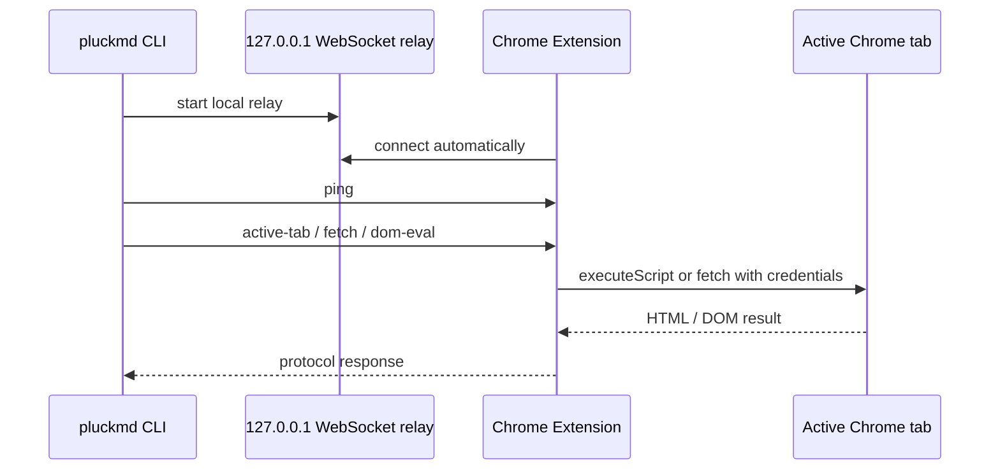

# Chrome Extension Bridge

## Purpose

The extension bridge lets pluckmd work with authenticated or bot-sensitive pages
that are already open in a user's local Chrome session. It is intended for local
unpacked extension usage. Chrome Web Store distribution is optional and not
required for the normal workflow.

## Architecture

## CLI Relay

Implemented by `ExtensionFetcher`.

- Binds to `127.0.0.1`.
- Default port is `7432`, overridable with `HARVEST_PORT`.
- Creates or reads a fallback token at `~/.pluckmd/extension-token`.
- Exposes `/health` for extension auto-connect checks.
- Accepts WebSocket upgrade when:
  - token is valid, or
  - origin is `chrome-extension://...`.
- If `HARVEST_EXTENSION_ID` is set, only that extension origin is accepted
  without token.

## Extension

Implemented by `packages/extension/src/background.js`.

Responsibilities:

- connect to the relay when installed, on startup, and on retry alarm
- check relay readiness before opening WebSocket
- handle protocol requests
- fetch pages with browser credentials
- read active-tab rendered HTML
- execute DOM operations in the active tab

## Permissions

The extension requests:

- `activeTab`
- `alarms`
- `scripting`
- `storage`
- `tabs`
- host access for `http://*/*`, `https://*/*`, localhost, and `127.0.0.1`

The broad `http/https` host access exists because pluckmd targets unknown
article sites. The extension should only send HTML to the local relay while a
CLI command is running.

## Security Requirements

- The relay must stay bound to localhost.
- Users must not expose `HARVEST_PORT` through tunnels or public interfaces.
- The CLI must not read Chrome cookie stores directly.
- Sensitive content handling is the user's responsibility.
- Local setups that keep the extension installed should prefer
  `HARVEST_EXTENSION_ID`.
