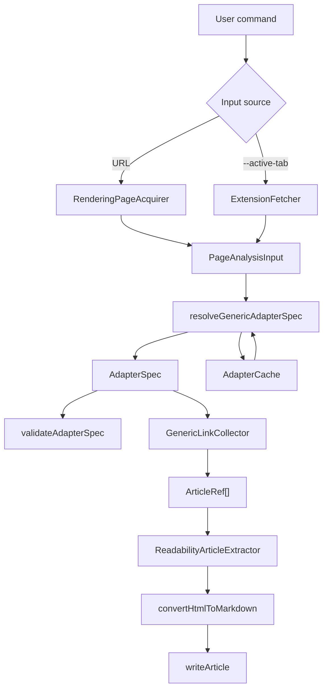

# System Overview

## Purpose

pluckmd downloads article listings into Markdown files. It targets blogs,
magazines, newsletters, CMS indexes, and authenticated browser sessions without
hardcoding website-specific source-code adapters.

The system is best understood as a generic extraction pipeline:

## Packages

### `packages/shared`

Defines data contracts used across the CLI and extension:

- `AdapterSpec`
- `PageAnalysisInput`
- `DomEvaluator`
- `LinkCollectionResult`
- extension protocol request/response types
- config path helpers

### `packages/cli`

Provides the `pluckmd` executable and implements:

- CLI option parsing and validation
- page acquisition
- generic adapter resolution
- adapter cache validation
- article link collection
- article extraction and Markdown writing
- Chrome extension relay
- setup command for agent skills

### `packages/extension`

Provides a local unpacked Chrome Extension that:

- automatically connects to the local CLI relay
- returns active-tab HTML
- fetches pages with browser credentials
- executes DOM operations needed for rendered pagination

## Primary Flows

### Download From URL

1. User runs `pluckmd download <url>`.
2. CLI validates numeric options and render mode.
3. `RenderingPageAcquirer` fetches static HTML.
4. If static HTML appears JavaScript-heavy and render mode is `auto`, it retries
   using Playwright.
5. `resolveGenericAdapterSpec` selects a runtime extraction spec.
6. `GenericLinkCollector` collects article links across pagination.
7. Each article page is acquired, extracted, converted to Markdown, and written.
8. CLI reports saved and failed articles.

### Download From Active Tab

1. User loads `packages/extension` locally as an unpacked extension.
2. User opens a page in Chrome and runs `pluckmd download --active-tab`.
3. CLI starts a local relay on `127.0.0.1`.
4. Extension connects automatically.
5. CLI receives rendered HTML and a live `DomEvaluator`.
6. The normal adapter resolution, link collection, and article extraction flow
   continues.

### Inspect

1. User runs `pluckmd inspect <url>` or `pluckmd inspect --active-tab`.
2. CLI acquires page analysis input.
3. If `--adapter-spec` is supplied, CLI validates and caches that spec.
4. Otherwise CLI resolves a spec with cache, heuristics, and optional LLM.
5. CLI prints source, confidence, selectors, validation summary, and link
   preview.
6. If LLM config is missing and heuristics are insufficient, CLI writes an
   agent request JSON.

## Non-goals

- Guaranteeing extraction for every website.
- Maintaining source-code adapters for fixed websites.
- Shipping a hosted service.
- Requiring Chrome Web Store distribution for the extension.
- Circumventing access controls or site terms.
